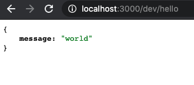

## 기존 람다 함수에서 느낀 불편한 점

기존에 express같은 웹 프레임워크를 쓰다가 Lambda로 넘어오게 되니 많은 문제점을 만났습니다.

그 중에서 가장 크게 불편했던 점이 라우팅과 관련된 코드를 다 짜줘야 한다는 것이었습니다.
예를 들면,

```typescript
if (path === "/") { ... }
```

이런 코드들을 계속 만들어야 합니다.
각 path 별로 람다 함수를 하나씩 만들어 붙일게 아니라면 말이죠..(예전에 그렇게 했었는데, 너무 비효율적이라고 생각합니다..)

거기다 request parameter validation나, 여러 당연한 기능들을 추가하려고 하면.. 지금보다 더 복잡해질 것 같았습니다.

이런 문제점 때문에 회사에서는 따로 사내 프레임워크를 개발해서 쓰고있긴 한데, 개인 프로젝트에는 회사의 손길(?)이 닿지 않길 바랬습니다.

그래서 저에게 익숙한 express를 AWS Lambda와 연결할 수 있는 방법을 찾아보게 되었습니다.

## aws-serverless-express

다행히도, [aws-serverless-express](https://www.npmjs.com/package/aws-serverless-express)라는 람다 함수 핸들러와 express 코드를 연결해주는 라이브러리가 있었습니다.

지금은 그것이 [@vendia/serverless-express](https://www.npmjs.com/package/@vendia/serverless-express)로 옮겨졌지만, type definitions 문제 때문에 기존의 라이브러리를 사용하게 되었습니다.

aws-serverless-express는 express의 사용법에 변화를 주지 않기 때문에, AWS Lambda와 함께 기존 사용법 그대로 사용할 수 있습니다.

따라서, 기존에 실시간으로 실행시키던 express 코드를 손쉽게 AWS Lambda로 마이그레이션 할 수도 있습니다.

혹여나 API Gateway에서 람다 함수에 넘겨주는 event 객체에 대한 접근이 필요한 경우, x-apigateway-event 헤더에 [url encoding](https://en.wikipedia.org/wiki/Percent-encoding)되어 있으므로, 이를 decode하고 파싱해서 사용하거나, aws-serverless-express에서 함께 제공하는 middleware를 통해 쉽게 접근할 수 있습니다.

## 적용

우선 매우 간단한 express 코드부터 작성해줍시다.

```typescript
import * as express from "express";

const app = express();

app.get("/hello", (req: express.Request, res: express.Response) => {
  return res.status(200).json({ message: "world" });
});

export { app };
```

그리고 작성한 코드를 import해서 aws-serverless-express에 연결해주면 됩니다.

```typescript
import * as serverlessExpress from "aws-serverless-express";
import { APIGatewayProxyHandler } from "aws-lambda";

import { app } from "./app";

const server = serverlessExpress.createServer(app);

export const handler: APIGatewayProxyHandler = (event, context) => {
  serverlessExpress.proxy(server, event, context);
};
```

## 실행

이제 테스트를 해볼텐데, 이럴 때 굳이 배포하지 않아도 로컬에서 확인해볼 수 있도록 도와주는 serverless-offline이라는 플러그인이 있습니다.

serverless 프레임워크에 대해서는 [이전 게시물](/2020-12-29-serverless-framework)을 참고해주세요.

플러그인을 설치하고, package.json의 scripts에 커맨드를 하나 추가해줍시다.

```
npm install -D serverless-offline
```

```
"scripts": {
  "start": "serverless offline"
},
```

그리고 npm start를 입력해주고 조금 기다리면 로컬 환경에서 테스트할 수 있게 됩니다.


## 결과

응답이 잘 오네요!


