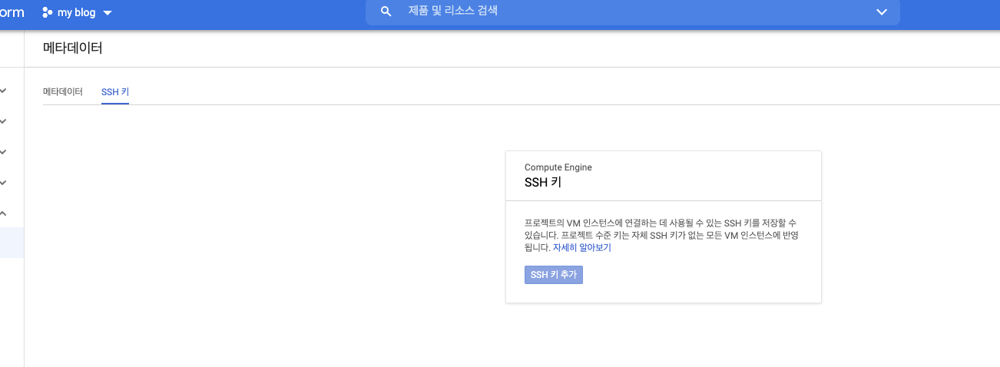
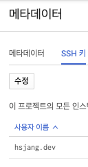

## 왜 GCP?

기존에 MySQL 서버를 AWS RDS로 사용하려고 했으나, 아직 돈이 없는 저는.. 슬프게도 최소사양 GCP 인스턴스를 택하게 되었답니다.

## SSH?

Secure Shell의 줄임말로, 두 컴퓨터 사이에서 public 네트워크를 통해 통신할 때 안전하게 하기 위해 사용되는 프로토콜입니다.

git으로 파일을 다운로드/전송하거나, AWS EC2 또는 GCP VM의 인스턴스에 원격으로 접속할 때 사용됩니다.

### SSH의 암호화 방식

그렇다면 SSH는 어떻게 정보를 지킬까요? SSH는 공개키 암호화를 사용합니다.

공개키 암호화와 함께 대칭키 암호화도 함께 정리하겠습니다.

#### 대칭키 암호화

대칭키 암호화는 송신자와 수신자가 서로 같은 키를 사용해 암/복호화를 하는 방식입니다.

즉, 송신자와 수신자는 서로 하나의 키를 주고받고, 그 키를 사용하여 송신자는 데이터를 암호화하여 전송하고, 수신자는 그것을 복호화합니다.

단, 키가 한번 유출되면 쉽게 정보를 가로챌 수 있다는 단점이 있습니다. 처음에 서로 키를 주고받는 과정에서 키를 탈취당한다면... 그 다음은... RIP..

#### 공개키 암호화

반면 공개키 암호화는 암/복호화에 키를 두 개 사용합니다. 따라서 비대칭키 암호화라고도 부릅니다. (서로 다른 키로 암/복호화 한다고 하여)

수신자는 송신자로부터 데이터를 다운로드 받기 위해, 자신만 가지고 있는 개인키와 송신자에게 알려줄 공개키를 생성합니다.

그리고 송신자는 수신자에게 받은 공개키를 사용하여 데이터를 암호화해서 전송하고, 수신자의 공개키로 암호화된 데이터는 오직 수신자의 개인키로만 복호화가 가능합니다.

즉, 공개키는 탈취당하더라도 정보가 노출될 위험이 상대적으로 적습니다. 이론적으로 공개키로 암호화된 데이터는 그와 쌍을 이루는 개인키로만 복호화가 가능하기 때문입니다.

단, 개인키가 노출된다면 아주 큰일이 벌어지겠죠.. RIP...

## SSH키 생성하기

SSH키 생성은 ssh-keygen 명령어를 사용해서 쉽게 할 수 있습니다.

아래와 같은 형식으로 작성해줍시다.

```
ssh-keygen -t rsa -f ~/.ssh/파일명 -C "내 GCP 구글 계정"
```

옵션을 간단히 설명드리면,

- -t: 암호화 방식을 설정하는 옵션입니다. RSA는 공개키 암호화 방식 중 하나입니다.
- -f: 저장할 파일의 경로와 이름을 정할 수 있습니다.
- -C: 공개키 뒤에 주석을 붙여줍니다. 여기서 붙여주는 이유는 [GCP 가이드](https://cloud.google.com/compute/docs/instances/adding-removing-ssh-keys?hl=ko#createsshkeys)을 참고해주세요.

저는 아래처럼 해주었습니다.

```
ssh-keygen -t rsa -f ~/.ssh/gcp_rsa -C "hsjang.dev@gmail.com"
```

passphrase를 입력하는 절차가 있을텐데, 나중에 접속할 때마다 비밀번호를 입력할거라면 설정해주고, 아니라면 그냥 엔터를 눌러서 설정하지 않으면 됩니다.

그러면 아래와 같이 ~/.ssh 디렉토리에 gcp_rsa, gcp_rsa.pub가 생성됩니다. 여기서 gcp_rsa.pub가 GCP에 등록해줘야 하는 공개키입니다.


## GCP에 공개키 등록하기

cat 명령어를 사용해서 위에서 생성한 공개키를 터미널에 출력한 후 복사해줍시다.

```
cat gcp_rsa.pub
```

그리고 GCP에서 Compute Engine 콘솔에 들어가주시고, 설정 -> 메타데이터로 들어가줍시다.


그리고 SSH 키 탭으로 들어가면 키를 추가할 수 있습니다. 여기에 복사한 공개키를 붙여넣어줍시다.



이 때, 사용자 이름을 기억해둡시다.



## 인스턴스 접속하기

이제 아래 명령어를 통해 인스턴스에 접속할 수 있습니다.

```
ssh -i [개인키 파일 경로] [사용자 이름]@[인스턴스 외부 IP]
```

인스턴스 외부 IP는 VM 인스턴스 화면에서 확인하실 수 있습니다.

-i 옵션은 SSH에 사용할 개인키를 직접 지정해주는 옵션입니다.

저는 아래처럼 입력해 주었습니다. (IP는 그냥 예시입니다)

```
ssh -i ~/.ssh/gcp_rsa hsjang.dev@0.0.0.0
```

아래와 같이 접속이 잘 되었네요.


## 쉘 스크립트 파일 만들어주기

앞으로 VM에 접속할일이 자주 있다면, 접속할 때마다 명령어를 계속 입력하는건 상당히 귀찮은 일입니다.

따라서 쉘 스크립트 파일(.sh)을 만들어서 간편하게 접속해봅시다.

아래의 명령어를 입력해줍시다. echo 뒤에는 인스턴스 접속 때 입력했던 ssh 명령어를 그대로 넣어줍시다.

```
echo [인스턴스 접속할 때 입력했던 명령어] > connect-gcp.sh
```

echo는 뒤에 적은 문자열을 바로 출력해주는 명령어인데, 리눅스나 맥에서는 (아마 윈도우도 될겁니다) '>'나 '>>'를 통해 명령어의 실행 결과를 파일의 내용에 추가할 수 있습니다.

'>'는 파일의 내용을 완전히 치환하고, '>>'는 파일의 맨 끝에 추가해줍니다. (파일이 없는 경우, 알아서 생성됩니다)

그리고 앞으로는 아래의 명령어로 매우 편하게 접속할 수 있습니다.

```
sh connect-gcp.sh
```

## P.S

GCP 무료 인스턴스가 너무 느려 터져서.. 오라클 클라우드에서 제공하는 평생무료 인스턴스로 갈아타니깐 훨씬 낫네요..!
