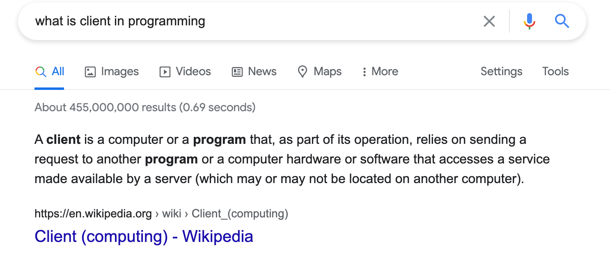

> OpenAPI Specification에 대해서는 [이전 글](/2021-03-27-open-api-specification)을 참고해주세요.

## API client?

구글에게 프로그래밍에서 client가 뭐냐고 물어보면 아래처럼 답변이 나옵니다.



간단히 요약하자면, 다른 무언가에게 요청을 보내는 프로그램 또는 컴퓨터가 client라고 할 수 있겠네요.

이 글에서 제가 말하는 API client는 대략 백엔드로 요청을 보내주는 라이브러리 정도로 정의하면 될 것 같습니다.

예를들면 아래와 같은 라이브러리인거죠.

```typescript
// API client 사용 안하면
axios.get("https://api.asdf.com/posts");

// API client 사용하면
client.getPosts({});
```

## API client의 필요성

API client 같은게 왜 필요할까요? 그냥 프론트엔드 개발자가 알아서 API 문서에서 찾아서 입력하면 되는거 아닌가요? ~~네 이게 문제입니다~~

제가 생각하는 API client가 필요한 이유를 하나씩 짚어보겠습니다.

(단, 필요성이 성립하려면 "자동 생성"이라는 전제 조건이 필요합니다.)

#### 개발자 경험이 매우 좋아진다.

백엔드 개발자는 API에 변경사항이 생기면, API client 라이브러리를 새로운 버전으로 생성해서 npm같은 곳에 publish하면 됩니다. (그리고 이런 작업도 github action 이나 semantic release 같은걸로 자동화할 수 있습니다.)

물론 API 문서를 업데이트하긴 해야겠지만, 이것도 충분히 자동화가 가능합니다. (router들을 모두 순회하며 request parameter, response parameter의 schema를 읽어들여서 문서를 자동 생성한다던지.. 여러 방법이 있을겁니다.)

그리고 프론트엔드 개발자는 API 문서를 보고 URL, request parameter, response body 등을 하나하나 확인하면서 코드를 짤 필요가 사라집니다. 그냥 새롭게 업데이트된 API client 라이브러리를 설치하면 됩니다. 또한 fully-typed하게 만들면 오타 때문에 오류가 날 일은 절대 없다고 봐도 됩니다.

#### API의 손쉬운 버전 관리가 가능해진다.

라이브러리로 배포하기 위해선 버전 관리가 당연히 필요하고, 자연스레 API도 버전 관리가 가능해집니다.

예를들어, 최신 버전의 API client에서 문제가 생기면, 이전 버전으로 되돌린 뒤(경우에 따라 백엔드도 revert가 필요하겠죠?) 문제를 확인하면 됩니다.

#### 여러 플랫폼에 적용할 수 있다.

API client를 자동 생성하는 코드를 한번 작업해 놓으면, 생성되는 코드 부분만 조금 수정하면 Java, Python, Swift 등 다른 언어로도 쉽게 생성할 수 있습니다.

즉, 웹이 아니더라도 안드로이드, IOS 등을 개발할 때에 쉽게 확장해서 쓸 수 있습니다.

## 설계

우선 CLI로 만들 것이기 때문에 어떤 옵션을 받을지부터 고민했습니다.

- 결과물을 어디에 내보낼지 output directory 경로를 받아야 합니다. (주어진게 없다면 default 경로로)
- OpenAPI Specification JSON을 어디서 가져올지 받아야 합니다. (해당 JSON을 불러올 수 있는 외부 URL 혹은 JSON 파일이 위치한 경로)

그리고 OpenAPI Specification은 다양한 형태로 작성할 수 있는데, (예를 들어 중복을 피하기 위한 Reference Object 사용) 그런 경우를 모두 고려하다보면 너무 복잡해질 것 같아서 OpenAPI Specification JSON에 제한 조건을 두기로 했습니다.

- operationId 필드는 모든 Operation Object에 필수로 주어져야 한다.
- Response Object의 MediaTypeObject의 schema 필드에는 Reference Object를 사용해야 한다.
  - 그 이외에는 Reference Object를 사용할 수 없다.
  - 단, Components Object 내부의 Schema Object들 끼리는 서로 Reference Object를 사용해 참조할 수 있다.
- Parameter Object 내에는 schema 필드가 주어져야 한다.
- Parameter Object의 in 필드에는 "path", "query"만 들어갈 수 있다.
- Content Object의 key는 "application/json"만 허용한다.
- Response Object는 성공 응답 하나만 정의하면 된다.
- 등등..

그리고 API Client를 생성하는 전체 과정을 고민했습니다.

1. 모든 Operation Object들을 읽어서 각각 Request Method, Request Parameters 등 코드 생성에 필요한 정보를 추출한다.
2. 1번을 기반으로 요청 method들(getPostList 같은 것들)이 들어가있는 client.ts 코드를 생성한다.
3. 모든 Schema Object들을 읽어서 Typescript Interface로 변환한다.
4. 3번을 기반으로 모든 타입 정의가 들어가있는 models.ts 코드를 생성한다.

이제 패키지를 만들기 위해 필요했던 핵심 기능들(CLI, object mapping)만 정리하겠습니다.

## CLI 만들기

[commander](https://www.npmjs.com/package/commander)라는 패키지를 사용해 CLI를 아주 쉽게 만들 수 있습니다.

```typescript
import { Command } from "commander";

const program = new Command();

program
  .command("generate")
  .description("generate OAS API client")
  .option("-u, --url <url>", "HTTP URL which provide OpenAPI specification (must be JSON)")
  .option("-f, --file <path>", "absolute or relative path of OpenAPI specification (must be JSON)")
  .option("-o, --outputDir <path>", "output path", "./oasis")
  .action(async (options) => {
    const { url, file, outputDir } = options;

    /* ... */
  });

program.parse();
```

## traverse로 객체 속성 순회하며 조작하기

[traverse](https://www.npmjs.com/package/traverse)라는 패키지로 객체의 모든 key-value 쌍을 순회하면서 필요하다면 update 메소드를 통해 수정까지 할 수 있습니다.

```typescript
import { SchemasObject } from "openapi3-ts";
import * as _ from "lodash";
import * as traverse from "traverse";
import { compile } from "json-schema-to-typescript";

import { BaseRenderer } from "./BaseRenderer";

export class ModelsRenderer extends BaseRenderer {
  private readonly schemas: SchemasObject;

  constructor(schemas: SchemasObject) {
    super();

    this.schemas = traverse(schemas).map(function (schema) {
      // set additionalProperties option to prevent generating '[k: string]: unknown' from json-schema-to-typescript
      if (schema?.type === "object") {
        this.update({
          ...schema,
          additionalProperties: false,
        });
      }
    });
  }

  public async render() {
    const schemaPairs = _.chain(this.schemas).toPairs().value();

    const models = await Promise.all(
      schemaPairs.map(async ([name, schema]) => {
        const updatedSchema = traverse(schema).map(function (value) {
          if (value?.$ref) {
            const splitedRef = (value.$ref as string).split("/");
            const schemaName = splitedRef[splitedRef.length - 1];
            this.update({
              ...schemaPairs.find(([name]) => name === schemaName)![1],
            });
          }

          if (value?.nullable) {
            this.update({
              anyOf: [
                {
                  ...value,
                  nullable: undefined,
                },
                { type: "null" },
              ],
            });
          }
        });

        return await compile(updatedSchema, name, { bannerComment: "" });
      })
    );

    return this.format(models.join("\n"));
  }
}
```

위는 Models.ts를 렌더링하는 ModelRenderer class 입니다.

부분적으로 설명을 드리자면,

- constructor
  - 모든 schema object를 순회하며 type이 object인 경우 additionalProperties: false를 추가하는 코드입니다.
  - 그걸 해주는 이유는 json-schema-to-typescript로 complie할 때 additionalProperties: false가 없는 경우, 아래 예시처럼 허용된 속성 외에 다른 속성들도 추가할 수 있는 interface를 생성하기 때문입니다.

```typescript
export interface Post {
  id: number;
  title: string;
  content: string;
  [k: string]: unknown;
}
```

- render
  - schemas obejcts를 name-schema 쌍의 pair로 바꾸고, traverse로 schema를 순회합니다.
  - reference object를 사용중인 경우, 참조하고 있는 schema를 가져와서 update합니다.
  - json-schema-to-typescript는 nullable을 핸들링하지 않아서, nullable: true인 schema가 들어오는 경우(상위 버전은 모르겠지만, OAS 3.0.1에서는 type: null 대신 nullable을 사용하라고 합니다) anyOf를 사용해서 기존 타입 + null인 union type으로 변경합니다.
  - 그리고 typescript interface로 compile합니다.
  - 위 과정을 여러번 거쳐야 하는데, 서로 의존성이 없으므로 Promise.all로 동시 실행합니다.
  - compile이 끝나면 BaseRenderer의 format 메소드(prettier 역할)로 이쁘게 만든 뒤 리턴합니다.

## 전체 코드

다른 코드는 그냥 설계 단계에서 정한 룰대로 operation들을 추출하는 것 뿐이어서, 궁금하시다면 [여기](https://github.com/HoseungJang/oas-api-client/tree/master/src)서 전체 코드를 확인하실 수 있습니다. ~~많이 더럽습니다~~

## 사용법

위에서 commander를 사용해서 CLI를 만들었으니, 아래와 같이 사용할 수 있습니다.

```
npx oas-api-client generate -f ./openapi.json
```

```
npx oas-api-client generate -u https://example.com/openapi
```

자동 생성된 결과물의 예시는 [여기](https://github.com/HoseungJang/oas-api-client/tree/master/example)서 확인하실 수 있습니다.

## 마무리

사실 [swagger-codegen](https://github.com/swagger-api/swagger-codegen)같이 이미 잘 만들어진 툴이 있긴 합니다.

그래도 스스로 이런 자동화를 모두 구축하면서 배우는게 있을 거라고 생각합니다. 예전부터 만들어보고 싶기도 했구요.

나중엔 다른 언어도 지원하도록 확장해볼 생각입니다.
