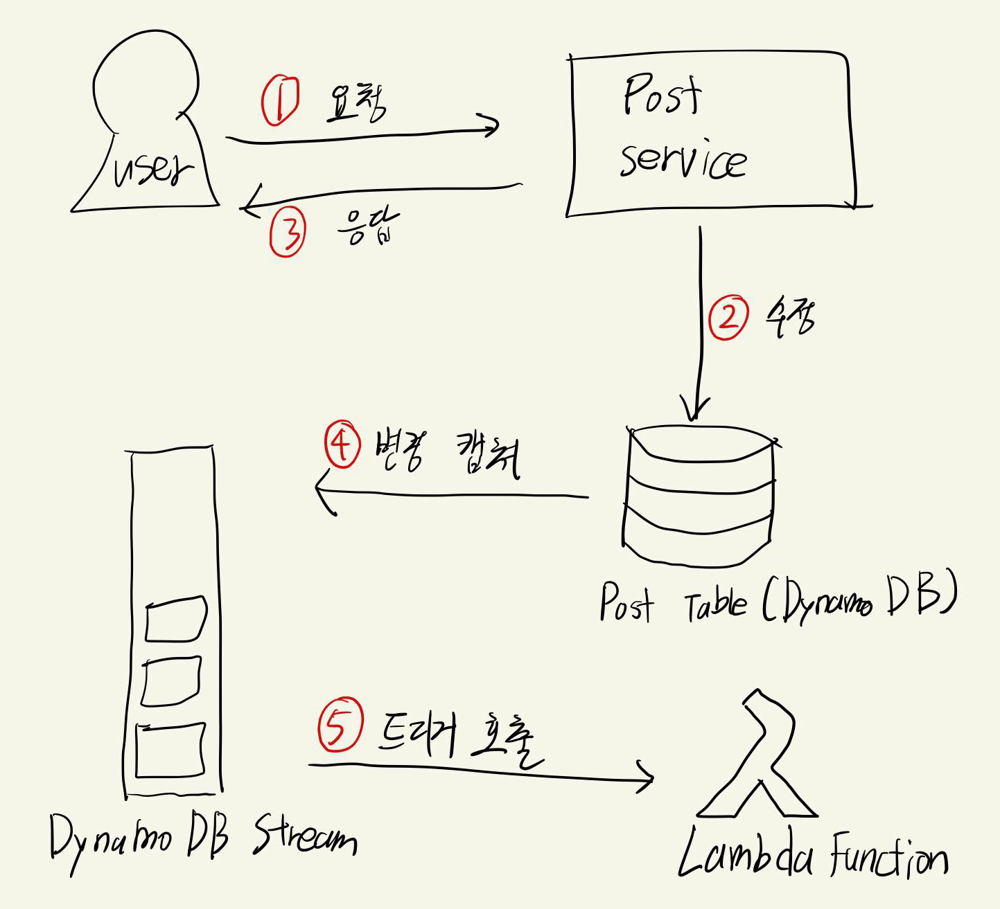
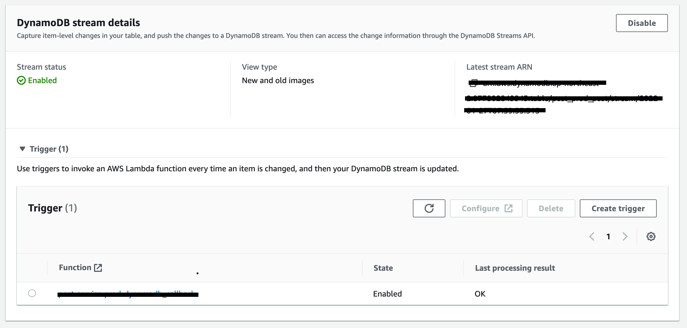

최근 회사에서 어드민들이 작성한 포스트를 검색할 수 있게 만드는 작업을 진행했었습니다.

이 글에서는 위 작업을 하면서 생각했던 내용과 개발 과정, 그리고 배운 점을 간략히 정리해보려고 합니다.

## 포스트를 어떻게 검색되게 할 것인가?

포스트는 AWS에서 제공하는 완전관리형(fully-managed) NoSQL 데이터베이스인 DynamoDB를 사용하여 관리하고 있었는데요. 기존 인프라에서 바로 검색을 적용할 수는 없었습니다. NoSQL과 DynamoDB의 특성상 데이터를 가져올 때 복잡한 조건을 걸 수가 없다는 문제가 있었기 때문입니다.

scan 작업에서 조건을 걸 수는 있지만, 그건 조건에 맞는 데이터만 scan하라는 의미가 아닙니다. 먼저 아무 조건이 없는 상태로 scan을 한 다음, 그 결과물을 [설정한 조건으로 한번 더 필터링](https://docs.aws.amazon.com/ko_kr/amazondynamodb/latest/developerguide/Scan.html#Scan.FilterExpression)하는 방식입니다. 따라서 응답 데이터의 개수가 클라이언트가 요청한 count와 다르게 응답될 수 있습니다.

이는 제대로된 Pagination이 불가능하다는 뜻이고, 클라이언트-서버 간 통신 비용과 유저 경험 면에서 큰 손해를 보게됩니다.

따라서 Post 데이터를 MySQL같은 RDB로 마이그레이션 하거나, Elasticsearch같은 검색 엔진에 인덱싱해서 구현해야 했습니다.

### RDB vs 검색엔진 중 어느 것을 선택할 것인가?

그렇다면 이런 상황에서 RDB와 검색엔진 중 어느 것을 선택하는게 올바른 선택일까요?

포스트는 아래 사진, 코드와 같이 여러 블록으로 이루어져 있습니다.


```typescript
type BlockSchema = |
  {
    type: "paragraph",
    text: string;
  } |
  {
    type: "image",
    image: {
      src: string;
      alt: string;
      width: number;
      height: number;
    }
  } |
  /* ... */

interface Post {
  /* ... */
  blocks: BlockSchema[];
}
```

위 데이터를 RDB로 옮기려면 블록 별로 테이블을 만들어서 1:n 관계를 형성하는게 좋아보입니다.

그러나 포스트 블록은 변경이 매우 자주 일어나는 데이터기 때문에, 그때마다 테이블을 추가/수정/삭제하는 비용이 NoSQL에 비해 훨씬 클 것으로 판단했습니다.

또한 포스트 블록보다 상위인 포스트 스키마 전체를 통틀어 바라봐도 스키마와 기능 변경이 자주 있었기 때문에, RDB는 어울리지 않는다고 판단했습니다.

따라서 DynamoDB를 유지하고, 현재 회사에서 사용하고 있는 Elasticsearch에 인덱싱해서 사용하기로 결정했습니다.

## 어떻게 인덱싱할 것인가?

포스트 DB에 변경이 일어나면 그 변경사항을 Elasticsearch 인덱스에도 반영을 해야할텐데요.

Elasticsearch처럼 별도로 분리된 서비스를 백엔드에서 호출하는 방식은 크게 두 가지로 정리할 수 있었습니다.

1. 백엔드 라우터에서 직접 호출
2. 메시징 큐 등을 사용해 따로 호출

### 1. 백엔드 라우터에서 직접 호출

```typescript
// 예시
const post = Post.get(postId);
post.content = newContent;
await post.save();

elasticsearch.index(post);

res.status(200).json({ post });
```

이 방식의 장점은 제가 생각하기엔 구현이 간단해 작업 비용이 작다는 점 말고는 딱히 없는 것 같습니다. 장점을 처참히 밟아버리는 단점들이 많이 존재하는데요.

우선 요청을 받은 라우터에서 Elasticsearch에 직접 인덱싱하게 되면, 인덱싱하는 시간 만큼 응답 시간도 느려진다는 문제가 있습니다.

또한 장애 전파를 막기가 힘든데요. Elasticsearch에 문제가 생겨서 에러가 throw되면, 그와 직접적으로 연결된 백엔드에도 장애가 전파되어 유저에게도 악영향을 주게 됩니다.

그리고 이 때 해당 에러를 try-catch 등을 사용해 넘어가더라도, Elasticsearch에 문제가 발생한 시간 동안 일어난 모든 변경사항은 인덱싱되지 않은채 유실되게 됩니다. 또한 별도의 retry로직을 작성하는 것도 꽤나 큰 비용이라고 판단됩니다.

### 2. 메시징 큐 등을 사용해 따로 호출

이 방식으로 1번 방식의 단점을 상쇄할 수 있습니다.

우선 클라이언트 단에서는 Elasticsearch 인덱싱을 기다릴 필요가 없어지므로 응답 시간이 절약되고, 이와 함께 Elasticsearch에서 장애가 발생하더라도 영향을 받지 않게 됩니다.

또한 AWS의 메시징 큐 서비스들은 consumer(대기열의 메시지를 받아서 처리하는 주체)에서 에러를 throw할 경우, 해당 위치에서 지속적으로 retry하기 때문에 변경 사항이 반영되지 않고 유실될 가능성도 1번 방식에 비해 매우 적습니다.

그리고 트래픽이 급격히 몰리는 경우 이를 분산해주는 역할도 하는데요. 1번 방식의 경우 Elasticsearch를 직접적으로 호출하기 때문에, 백엔드에 트래픽이 몰릴 경우 Elasticsearch에도 그대로 전달되게 됩니다.

하지만 메시징 큐 같은 대기열을 사용하면 일반적으로 consumer가 한번에 처리할 수 있는 작업의 사이즈를 정해둘 수 있기 때문에, 트래픽 증가로 인해 메시지가 급격히 늘어나더라도 지정한 단위로 쪼개서 처리할 수 있습니다.

따라서 2번 방식으로 처리하는 것이 더 적합하다고 판단했습니다.

## DynamoDB의 변경을 감지하는 방법?

데이터베이스에는 Change Data Capture(줄여서 CDC)라는 개념이 있는데요. 말 그대로 데이터베이스에 일어난 변경 사항을 캡쳐하여, 그에 필요한 후속 처리(Elastic search에 인덱싱, Read Replica와 싱크 등)를 자동화할 수 있도록 하는 기술입니다.

AWS RDS에서는 대표적으로 AWS Database Migration Service + Kinesis Stream을 사용해 S3에 저장허거나, Lambda Function을 트리거하는 등 여러 처리를 할 수 있습니다.

DynamoDB도 DynamoDB Stream이라는 기능으로 CDC를 지원합니다. DynamoDB 테이블에 일어난 변경(추가/수정/삭제)을 Stream 형태로 제공하여 순차적으로 처리할 수 있게 돕는 기능입니다.

Elasticsearch를 호출하는 AWS Lambda Function을 작성한 후, DynamoDB Stream의 트리거로써 연결하여 처리하면 됩니다.

DynamoDB Stream도 연결된 트리거에서 에러를 throw할 경우, 데이터를 유실하지 않고 retry합니다.

즉, 간략한 플로우를 그려보면 아래와 같습니다. (~~아이패드로 대충 그렸습니다~~)



## DyanmoDB Stream 트리거 만들기

이제 DynamoDB Stream의 트리거가 될 Lambda Function을 만들어야 합니다. 공식 가이드의 [4단계: Lambda 함수 생성 및 테스트](https://docs.aws.amazon.com/ko_kr/amazondynamodb/latest/developerguide/Streams.Lambda.Tutorial.html#Streams.Lambda.Tutorial.LambdaFunction)를 참고하면, DynamoDB Stream에선 Lambda Function에 아래와 같은 형식의 event 객체를 넘겨줍니다.

```json
{
  "Records": [
    {
      "eventID": "7de3041dd709b024af6f29e4fa13d34c",
      "eventName": "INSERT",
      "eventVersion": "1.1",
      "eventSource": "aws:dynamodb",
      "awsRegion": "region",
      "dynamodb": {
        "ApproximateCreationDateTime": 1479499740,
        "Keys": {
          "Timestamp": {
            "S": "2016-11-18:12:09:36"
          },
          "Username": {
            "S": "John Doe"
          }
        },
        "NewImage": {
          "Timestamp": {
            "S": "2016-11-18:12:09:36"
          },
          "Message": {
            "S": "This is a bark from the Woofer social network"
          },
          "Username": {
            "S": "John Doe"
          }
        },
        "SequenceNumber": "13021600000000001596893679",
        "SizeBytes": 112,
        "StreamViewType": "NEW_IMAGE"
      },
      "eventSourceARN": "arn:aws:dynamodb:region:123456789012:table/BarkTable/stream/2016-11-16T20:42:48.104"
    }
  ]
}
```

위와 같은 event 객체를 그대로 사용하기엔 꽤나 귀찮습니다. DynamoDB의 데이터 형식(N, S)과 매핑되어 있기 때문이죠.

AWS SDK V3의 util-dynamodb에서 제공하는 unmarshal 함수를 사용하면 쉽게 위 매핑을 풀 수 있긴 하지만, 저는 저희 개발팀에서 만든 [dynamorm-stream](https://github.com/serverless-seoul/dynamorm-stream)이라는 오픈소스를 사용하여 작성했습니다.

> dynamorm-stream을 사용하기 위해선 저희 팀의 또다른 오픈소스인 [dynamorm](https://github.com/serverless-seoul/dynamorm)을 사용해 DynamoDB 테이블을 정의하셔야 합니다.

dynamorm-stream은 DynamoDB의 복잡한 event 객체를 쉽게 사용할 수 있도록 가공해서 넘겨주고, 에러 핸들링도 지원합니다.

```typescript
import { TableHandler } from "@serverless-seoul/dynamorm-stream";
import type { InsertStreamEvent, ModifyStreamEvent, RemoveStreamEvent } from "@serverless-seoul/dynamorm-stream";

import { Post } from "../../models/dynamodb";

import { catchError } from "../helpers/catch_error";

import { clients } from "../clients";

export async function handler(
  events: Array<InsertStreamEvent<Post> | ModifyStreamEvent<Post> | RemoveStreamEvent<Post>>
) {
  await Promise.all(
    _.chain(events)
      .map((event) => {
        switch (event.type) {
          case "INSERT": /* ... */
          case "MODIFY": /* ... */
          case "REMOVE": /* ... */
        }
      })
      .map((data) => clients.search.indexPosts.dispatch({ data }))
      .value()
  );
}

export const postHandler = new TableHandler(
  Post,
  "Series",
  [
    {
      eventType: "ALL",
      name: handler.name,
      handler,
    },
  ],
  catchError
);
```

저희 개발팀은 AWS Lambda에 기반해 serverless + MSA로 설계된 백엔드를 개발하고 있는데요.

위의 handler 함수 내부에서 호출하는 `clients.search.indexPosts.dispatch`는 저희 백엔드 서비스들 중 하나인 search 서비스의 Lambda Function을 asynchronous로 호출합니다.

그런데 이 때 위의 handler 함수에서 실수한 점은 무엇일까요?

[AWS Lambda 문서](https://docs.aws.amazon.com/lambda/latest/dg/gettingstarted-limits.html#function-configuration-deployment-and-execution)를 보시면, Invocation Payload를 asynchronous 호출인 경우 256KB로 제한하고 있습니다만, handler 함수에선 관련 처리를 아무것도 해주지 않았습니다. (실제로 개발 서버에서 테스트 중 에러가 났었습니다.)

그래서 chunkByByteLength라는 간단한 함수를 만들어서 payload 용량을 맞춰주었습니다.

```typescript
export function chunkByByteLength<T>(array: T[], threshold: number) {
  const chunks: T[][] = [];
  let buffer: T[] = [];

  for (const chunk of array) {
    buffer.push(chunk);
    const size = Buffer.byteLength(JSON.stringify(buffer));

    if (size > threshold) {
      const last = buffer.pop()!;
      chunks.push(buffer);
      buffer = [last];
    }
  }
  if (buffer.length) {
    chunks.push(buffer);
  }

  return chunks;
}
```

```typescript
await Promise.all(
  _.chain(events)
    .map((event) => {
      switch (event.type) {
        case "INSERT": /* ... */
        case "MODIFY": /* ... */
        case "REMOVE": /* ... */
      }
    })
    // chunk by 200KB
    .thru((payload) => chunkByByteLength(payload, 200 * 1024))
    .map((data) => clients.search.indexPosts.dispatch({ data }))
    .value()
);
```

## 기존 포스트 데이터 전체를 Elasticsearch에 인덱싱

DynamoDB Stream과 Lambda Function을 통해 변경 데이터를 싱크하는 것은 구현했지만, 기존에 존재하는 모든 포스트 데이터를 Elasticsearch에 인덱싱하는 과정도 한 번 필요했습니다.

포스트 데이터 자체가 650개 정도로 매우 적었기 때문에, 간단한 스크립트를 작성해서 빠르게 Elasticsearch에 인덱싱할 수 있었습니다. 스크립트에서도 저희 개발팀의 오픈소스인 [dynamorm](https://github.com/serverless-seoul/dynamorm)을 사용합니다.

```typescript
import { Post } from "../src/models/dynamodb/post";

export async function scanAllPosts(): Promise<Post[]> {
  let posts: Post[] = [];
  try {
    let exclusiveStartKey = undefined;

    do {
      const result = await Post.primaryKey.scan({ exclusiveStartKey });
      posts = [...posts, ...result.records];
      exclusiveStartKey = result.lastEvaluatedKey as any;
    } while (exclusiveStartKey);

    return posts;
  } catch (e) {
    console.log(e);
    throw e;
  }
}
```

우선 테이블의 모든 레코드를 스캔하는 scanAllPosts 함수를 먼저 작성했습니다. do / while 문을 사용한 이유는, DynamoDB의 scan 작업은 최대 1MB의 결과만을 응답하고, 그 뒤의 데이터를 더 불러오려면 lastEvaluatedKey라는 커서값을 exclusiveStartKey에 넣어 다시 요청해야 하기 때문입니다.

즉, scan 결과에 lastEvaluatedKey가 없어야만 모든 레코드의 scan이 끝난 것이라고 생각하시면 됩니다.

이제 indexlAllPosts라는 함수를 작성하고 실행해주면 모든 포스트의 인덱싱까지 완료입니다.

```typescript
import _ from "lodash";

import { scanAllPosts } from "./scan_all_posts";

import { clients } from "../src/dynamodb_callback/clients";

import { chunkByByteLength } from "../src/dynamodb_callback/handler/post";

async function indexAllPosts() {
  const posts = await scanAllPosts();
  try {
    await Promise.all(
      _.chain(posts)
        .map((post) => /* ... */)
        // chunk by 200KB
        .thru((payload) => chunkByByteLength(payload, 200 * 1024))
        .map((data) => clients.search.indexPosts.dispatch({ data }))
        .value(),
    );
  } catch (e) {
    console.log(e);
  }
}

indexAllPosts();
```

## DynamoDB Stream 활성화
DynamoDB Stream은 AWS 콘솔에서 매우 쉽게 활성화할 수 있는데요.

DynamoDB 테이블 세팅에서 ```Exports and streams```탭으로 이동한 후, ```DynamoDB stream details```에서 [공식 문서](https://docs.aws.amazon.com/ko_kr/amazondynamodb/latest/developerguide/Streams.html#Streams.Enabling)를 참고하여 Enable하면 됩니다.

그리고 위에서 만들었던 AWS Lambda Function을 트리거에 추가해주면, 테이블에 변경이 일어날 때마다 변경 사항이 전달됩니다.



## 마무리

저는 기존에 AWS Lambda 같은 서비스를 프론트엔드 서포트용(SEO)이나 백엔드 배포용으로만 사용했었는데요. 이번 작업을 하면서 Lambda를 AWS기반의 분산 처리 아키텍처에도 무궁무진하게 응용할 수 있다는 것을 배울 수 있어 좋았습니다.

그리고 서로 독립적인 여러 서비스가 통신을 주고받을 때, 바람직한 호출 과정은 무엇인가에 대해 고민해볼 수 있었던 것도 좋았습니다. RDB와 NoSQL DB를 비교하여 적합한 결정을 내린 경험도 좋았구요. 배운게 정말 많은 작업이었습니다.

마지막으로, 잘못된 점이나 추가하면 좋을 듯한 내용, 개선할 점 등은 바로 피드백 주시면 감사드리겠습니다.
